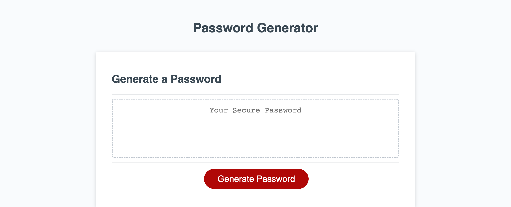
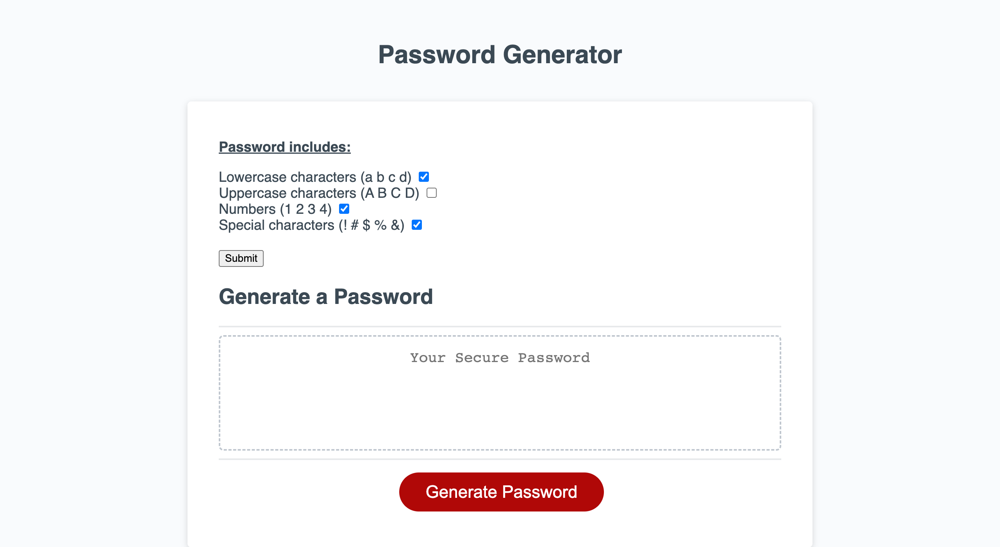
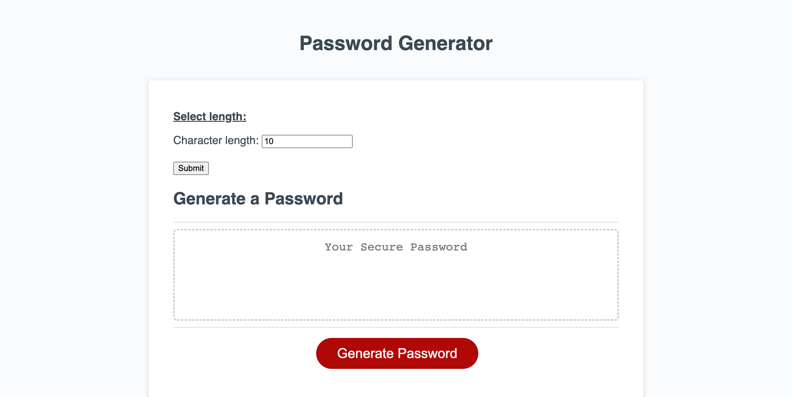
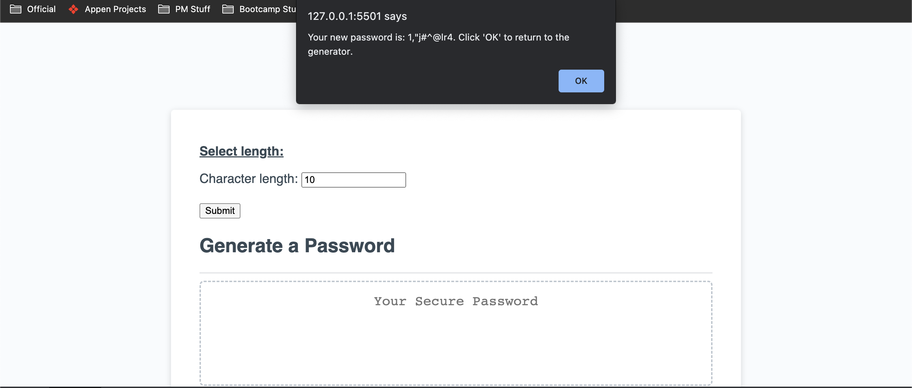

# 03-Password-Generator

## Project Description
<a href="https://hanwol525.github.io/03-Password-Generator">Deployed page</a>

This is a refactor of existing code to create a password generator. The generator allows users to configure password characters and input a length between 8 and 128 characters; a password meeting these criteria will then display in an alert.

## Technology Used
<ul>
<li>HTML - provides structure and basic content for the site, including character/length selection prompts
<li>CSS - provides style for the page
<li>JavaScript - for password generator interactivity
</ul>

## Overview of Site

## Summary
<ul>
<li>Used HTML to create forms for the character selection and length selection prompts
<li>Used JavaScript to create the generator functions
</ul>

## Resources Used
<ul>
<li><a href="https://www.w3schools.com/jsref/prop_style_display.asp">Styling display property with JavaScript</a>
<li><a href="https://stackoverflow.com/questions/9887360/how-can-i-check-if-a-checkbox-is-checked">Checking if a checkbox is checked</a>
</ul>

## Links
<ul>
<li>Github: <a href="https://github.com/hanwol525">hanwol525</a>
</ul>
